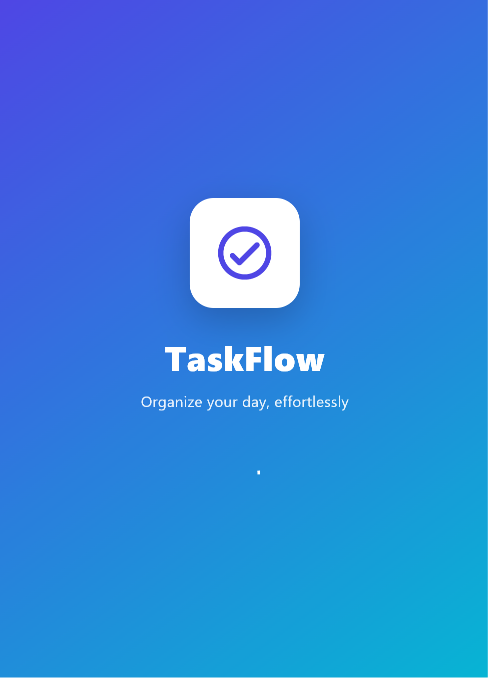
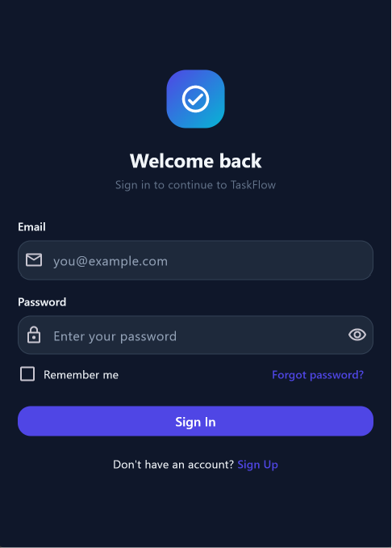
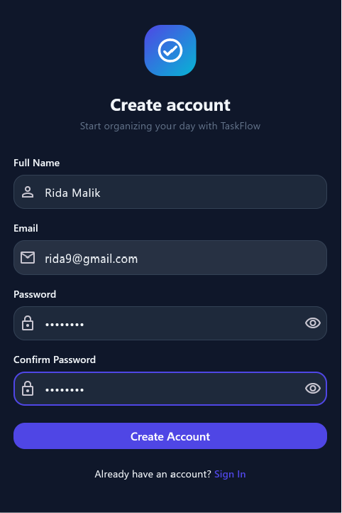
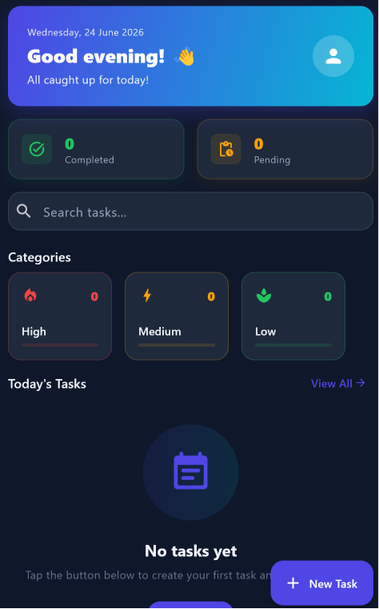
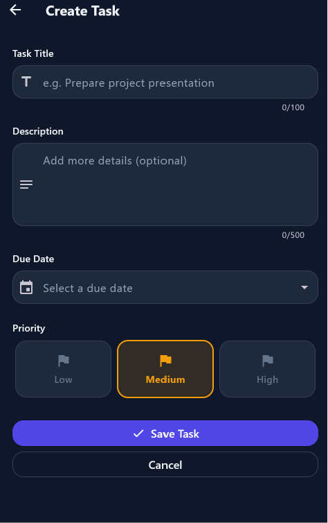

# TaskFlow 📋
> Organize your day, effortlessly.

A Flutter task management app with authentication, dashboard, and full task CRUD functionality.

---

## Screens

### Splash Screen


### Login


### Register


### Home Dashboard


### Create Task


---

## Features

- Splash screen with branding
- Login with email, password, remember me, forgot password
- Registration with full name, email, password validation
- Home dashboard with completed and pending task counts, search, and categories
- Create, edit, delete, and complete tasks
- Priority levels — Low, Medium, High
- Due date picker

## Tech Stack

| Technology | Purpose |
|------------|---------|
| Flutter | Cross-platform UI framework |
| Dart | Programming language |
| Riverpod | State management |
| Go Router | Navigation and routing |
| Flutter Form | Input validation |
| Material Design 3 | UI components and theming |

---

## Getting Started

```bash
flutter pub get
flutter run
```
